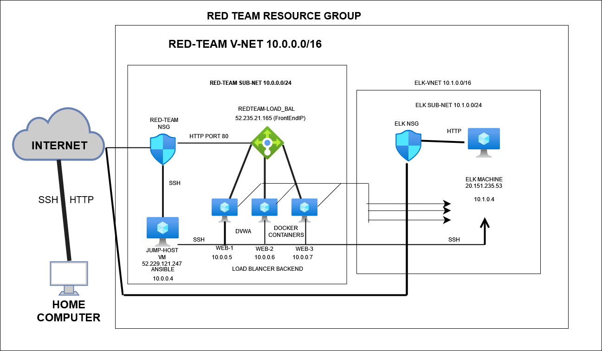
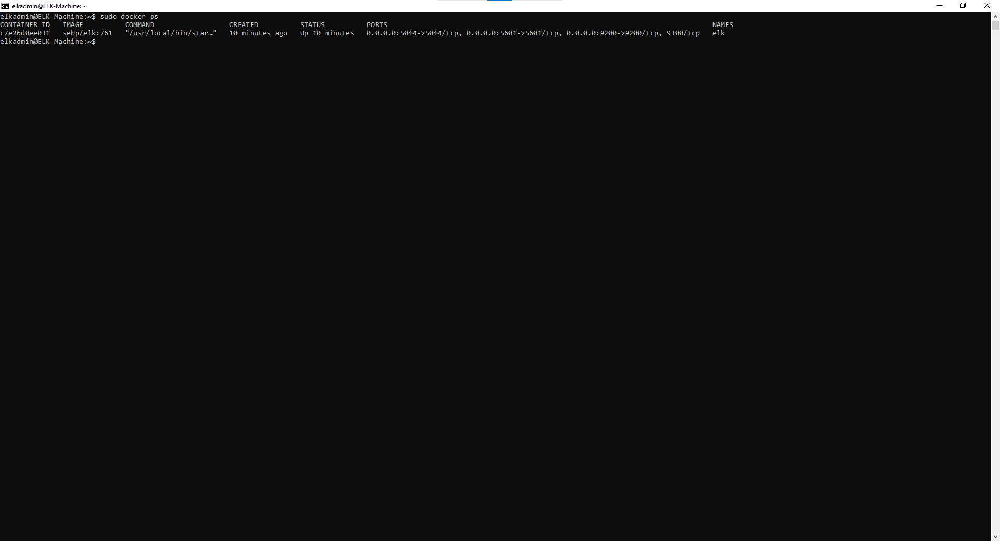

## Automated ELK Stack Deployment

The files in this repository were used to configure the network depicted below.

These files have been tested and used to generate a live ELK deployment on Azure. They can be used to either recreate the entire deployment pictured above. Alternatively, select portions of the playbook file may be used to install only certain pieces of it, such as Filebeat.

  - (Ansible_YAML_files/filebeat-playbook.yml)

This document contains the following details:
- Description of the Topology
- Access Policies
- ELK Configuration
  - Beats in Use
  - Machines Being Monitored
- How to Use the Ansible Build

### Description of the Topology

The main purpose of this network is to expose a load-balanced and monitored instance of DVWA, the D*mn Vulnerable Web Application.

Load balancing ensures that the application will be highly available, in addition to restricting  unwanted access to the network.
- in addition to allowing the application to be highly available, load balancing also allows network access control, which in turn adds a layer of security and is able to mitigate and prevent smallscale dos attacks (denial of service) from taking place. This is done by securing the network through certain protocols such as private network IP address or by the use of  ssh keys. 
- 
- a Jumpbox serves as a secure public facing gateway for a user to connect from outside of the network using a secure shell protocol (SSH)  

Integrating an ELK server allows users to easily monitor the vulnerable VMs for changes to the network and system logs.
- _Filebeat is used to monitor and collect log data and pushes it to Elasticsearch and/or Logstash where the data can be viewed and indexed_
- Metricbeat on the other hand collects the metrics "cpu/ram usage, network utilization" of the operating system and servers and forwards them to Elasticsearch/Logstash so that the adminstrator can see in realtime the status  of these componets.

The configuration details of each machine may be found below.

| Name     | Function | IP Address | Operating System |
|----------|----------|------------|------------------|
| Jump Box | Gateway  | 10.0.0.4  |    Linux/ubuntu   |
| Web-1    | Web Svr |  10.0.0.5  |    Linux/ubuntu   |
| Web-2    | Web Svr |  10.0.0.6  |    linux/ubuntu   |
| Web-3    | Web Svr |  10.0.0.7  |    Linux/ubuntu   |
| Elk-VM   |ELKSTACK | 10.1.0.4   |    Linux/ubuntu   |
### Access Policies

The machines on the internal network are not exposed to the public Internet. 

Only the Host machine (jump-box) can accept connections from the Internet. Access to this machine is only allowed from a secured connection from my personal IP address.

Machines within the network can only be accessed by port 22 (ssh protocol).
-The jumpbox is the only machine that can access the  ELK machine by making a ssh connection once inside the ansible container.

A summary of the access policies in place can be found in the table below.

| Name     | Publicly Accessible | Allowed IP Addresses |
|----------|---------------------|----------------------|
| Jump Box |       Yes           | Personal IP Address  |
| DVWA-VMs |       No            | 10.0.0.4             |
| ELK Stack|        No           | 10.0.0.4             |

### Elk Configuration

Ansible was used to automate configuration of the ELK machine. No configuration was performed manually, which is advantageous because once the playbook is written you can deploy the playbook using only a few commands across a vast network of machines simultaneously. which gretly cuts down the time it takes to deploy vs. manually installing it one by one. 

The playbook implements the following tasks:

   - Install docker.io
    - Install python3-pip
    - Install docker via pip
    - Increase virtual memory
    - Use more memory
    - Enable service docker on boot

The following screenshot displays the result of running `docker ps` after successfully configuring the ELK instance.

### Target Machines & Beats
This ELK server is configured to monitor the following machines:
 | Name     | Allowed IP Addresses |
|----------|----------------------|
| web-1 | 10.0.0.5                |
| web-2 | 10.0.0.6                |
| web-3 |  10.0.0.7               |

We have installed the following Beats on these machines:
- (Ansible_YAML_files/filebeat-playbook.yml)
- (Ansible_YAML_files/metricbeat_playbook.yml)

These Beats allow us to collect the following information from each machine:
- Filebeat allows for the forwarding of log data to to Elasticsearch/Logstash. Once data has been transported the user is able to acces and read this data in a GUI (graphical user interface)
- Metribeat works in the same fashion but instead of log data its pushing metrics of the operating system (cpu/ram usage details) to the GUI.

### Using the Playbook
In order to use the playbook, you will need to have an Ansible control node already configured. Assuming you have such a control node provisioned: 

SSH into the control node and follow the steps below:
- Copy the filebeat-config.yml file to ELK VM.
- Update the hosts file to include 10.0.0.5, 10.0.0.6, 10.0.0.7
- Run the playbook, and navigate to Kibana (PUBLIC_IP:5601)to check that the installation worked as expected.
